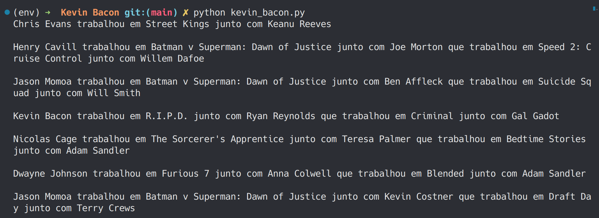
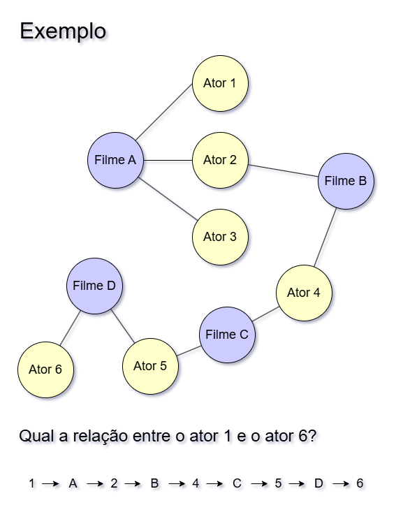

# Os Seis Graus de Kevin Bacon
_Por João Felipe Ribeiro_  
_24/11/2024_
  
<sup>_Exemplo uma saída do programa_</sup>

## Introdução

Os "Seis Graus de Kevin Bacon" são um conceito inspirado pela teoria dos "seis graus de separação", que sugere que qualquer pessoa no mundo está conectada a qualquer outra por, no máximo, seis intermediários. Adaptado para o mundo do cinema, o jogo propõe que qualquer ator pode ser ligado a Kevin Bacon através de, no máximo, seis conexões baseadas em filmes em que atuaram juntos. Por exemplo, se o ator A trabalhou com o ator B em um filme, e B trabalhou com Kevin Bacon, então A tem um "número de Bacon" de 2. A ideia tornou-se um fenômeno cultural, enfatizando como as redes de colaboração no cinema (e na sociedade) são interconectadas.

## Resumo

Na implementação da ideia as relações entre os atores pode ser descrita como um grafo não direcionado. A estrutura de dados interliga os atores ao seus filmes e outros atores, permitindo que um caminho seja traçado entre eles.


  
<sup>_Grafo não direcionado que interliga os filmes e os atores_</sup>

Para realizar a busca do caminho entre os atores, utiliza-se um algoritmo **guloso** para encontrar o primeiro melhor e mais curto caminho entre eles.

Para isso, é necessário utilizar uma variação do **Breadth First Search**, um algoritmo de pesquisa em largura para grafos. Nessa variação, é criado uma **queue** (fila) com todos os caminhos que foram percorridos. Se o caminho achado não for o caminho final entre os atores, a fila anda e um próximo caminho é analisado. Portanto o algoritmo é **guloso** pois ele sempre vai achar o **primeiro** caminho e o de menor tamanho (que é melhor para o caso).

## Algoritmo de Pesquisa em Largura (Breadth First Search Algorithm)

Pseudo-código para o algoritmo utilizado:

```
Função BFS(grafo, ator_inicial, ator_final):
    Se ator_final não estiver no grafo:
        Lançar erro: "Esse ator não existe na base de dados"

    Fila <- []
    Inserir [ator_inicial] na Fila

    Enquanto a Fila não estiver vazia:
        Caminho <- Remover o primeiro elemento da Fila
        Nodo <- Último elemento do Caminho

        Se Nodo for igual a ator_final:
            Retornar Caminho

        Para cada adjacente em grafo[Nodo]:
            Novo_Caminho <- Copiar Caminho
            Adicionar adjacente ao Novo_Caminho
            Inserir Novo_Caminho na Fila

    Retornar Nulo
```

## Banco TMDB

Para implementar a utilização do banco de dados do TMDB, foi utilizado um arquivo csv contendo todos os dados dos filmes. Porém nem todos os dados são úteis para o projeto. Os únicos dados relevantes são os nomes dos filmes e dos atores. Portanto foi realizado uma filtragem para que fosse gerado um dicionário apenas com esses dados.

## Construindo o grafo

A primeira etapa para construir o grafo é gerar um dicionário contendo uma relação filme:atores para cada item.

Percebe-se que a partir disso, temos um grafo **direcionado**. Ou seja, só existe a direção filmes para atores.

Em seguida, precisamos realizar a conversão desse grafo direcionado para um grafo indirecionado. Ou seja, precisamos de um grafo em que os filmes apontem para os atores, mas que os atores também apontem para os filmes.

Enfim, teremos um grafo não direcionado.

## Renderizando a pesquisa

Para escrever frases como "Chris Evans trabalhou em Street Kings junto com Keanu Reeves" foi criado um simples algoritmo que alterna entre conectivos para a frase de acordo com o índice do elemento do caminho do grafo.
