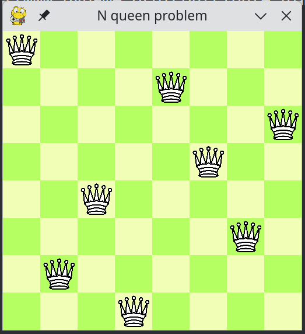
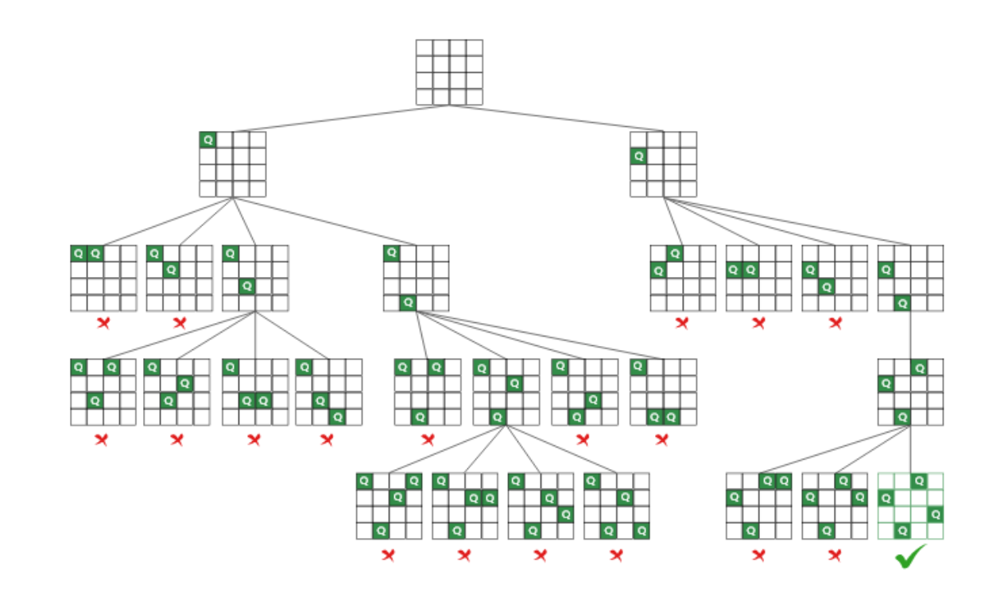
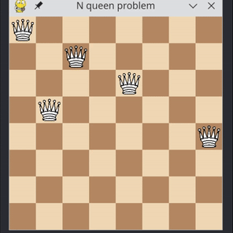

# O problema das N damas
_Por João Felipe Ribeiro_


<sup>_Exemplo de um tabuleiro com as damas posicionadas (n=8)_</sup>

<br/>
<br/>
<br/>

## Introdução

O problema das N-damas é um desafio clássico da teoria dos jogos e da ciência da computação, onde o objetivo é posicionar **N damas** em um tabuleiro de xadrez de dimensão N x N de forma que nenhuma dama ataque outra. Como as damas no xadrez podem se mover em linhas, colunas e diagonais, a solução exige que não haja mais de uma dama na mesma linha, coluna ou diagonal. Este problema é frequentemente usado para demonstrar algoritmos de busca, como backtracking, e possui várias aplicações em áreas como inteligência artificial e otimização combinatória.

## Implementação

Dado um tabuleiro de Xadrez N x N, em quais casas podemos posicionar N rainhas sem que nenhuma rainha seja ameaçada por outra?

Para resolver esse problema, é necessário implementar um algoritmo recursivo de **tentativa e erro** (Backtracking) para econtrar a solução. Como mostrado nesta imagem, temos uma árvore de recursão que mostra todas as tentativas de alocar as N rainhas no tabuleiro.


<sup>_Fonte: GeeksForGeeks_</sup>

Esta é a função recursiva que resolve o tabuleiro:
```
Função solve(board, col):
    Se col >= N:
        Retorne Verdadeiro

    Para cada i de 0 até N-1:
        Se é seguro colocar a rainha em board[i][col]:
            board[i][col] <- 1
            Se solve(board, col + 1) for Verdadeiro:
                Retorne Verdadeiro
            board[i][col] <- 0
    
    Retorne Falso
```

O algoritmo explora todas as possibilidades de colocação das damas de maneira sistemática e retrocede sempre que encontra um caminho inválido.

## Determinar se o local é seguro

Este é o pseudo-código para a função `is_safe()`, que retorna verdadeiro se um local não sofrer ameaças de nenhuma rainha no tabuleiro.

```
Função é_seguro(tabuleiro, linha, coluna):
    # Verificar linha
    Para c de coluna-1 até 0:
        Se há_dama(tabuleiro, linha, c):
            Retorne Falso
    
    Para c de coluna+1 até tamanho_do_tabuleiro:
        Se há_dama(tabuleiro, linha, c):
            Retorne Falso

    # Verificar coluna
    Para r de linha-1 até 0:
        Se há_dama(tabuleiro, r, coluna):
            Retorne Falso

    Para r de linha+1 até tamanho_do_tabuleiro:
        Se há_dama(tabuleiro, r, coluna):
            Retorne Falso

    # Verificar primeira diagonal (\)
    # Subindo à esquerda
    i <- linha - 1
    j <- coluna - 1
    Enquanto i >= 0 e j >= 0:
        Se há_dama(tabuleiro, i, j):
            Retorne Falso
        i <- i - 1
        j <- j - 1

    # Descendo à direita
    i <- linha + 1
    j <- coluna + 1
    Enquanto i < tamanho_do_tabuleiro e j < tamanho_do_tabuleiro:
        Se há_dama(tabuleiro, i, j):
            Retorne Falso
        i <- i + 1
        j <- j + 1

    # Verificar segunda diagonal (/)
    # Subindo à direita
    i <- linha - 1
    j <- coluna + 1
    Enquanto i >= 0 e j < tamanho_do_tabuleiro:
        Se há_dama(tabuleiro, i, j):
            Retorne Falso
        i <- i - 1
        j <- j + 1

    # Descendo à esquerda
    i <- linha + 1
    j <- coluna - 1
    Enquanto i < tamanho_do_tabuleiro e j >= 0:
        Se há_dama(tabuleiro, i, j):
            Retorne Falso
        i <- i + 1
        j <- j - 1

    # Nenhuma ameaça encontrada
    Retorne Verdadeiro
```


